# 🎮 ARKANOID - THẾ HỆ MỚI (JavaFX Arcade Game)

<p align="center">
  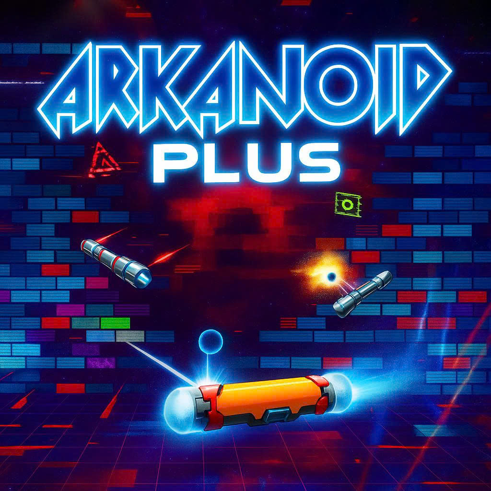
</p>

<p align="center">
  
  
  
  
</p>

---

## 📖 Mục lục
1. [Giới thiệu Trò chơi](#-giới-thiệu-trò-chơi)
2. [Video Demo](#-video-demo)
3. [Tính năng Nổi bật](#-tính-năng-nổi-bật)
4. [Sơ đồ Lớp Thiết kế (UML Class Diagram)](#-sơ-đồ-lớp-thiết-kế-uml-class-diagram)
5. [Kiến trúc & Design Patterns](#-kiến-trúc--design-patterns)
6. [Hướng dẫn Cài đặt & Chạy Game](#-hướng-dẫn-cài-đặt--chạy-game)
7. [Hướng dẫn Chơi & Điều khiển](#-hướng-dẫn-chơi--điều-khiển)
8. [Hệ thống Vật phẩm (Buff & Debuff)](#-hệ-thống-vật-phẩm-buff--debuff)
9. [Hệ thống Gạch & Màn chơi](#-hệ-thống-gạch--màn-chơi)
10. [Phân công Công việc & Đóng góp](#-phân-công-công-việc--đóng-góp)

---

## 🌟 Giới thiệu Trò chơi

**ARKANOID_LTNC** là phiên bản tái hiện và hiện đại hóa tựa game arcade kinh điển *Arkanoid / Breakout* được phát triển bằng ngôn ngữ **Java 17** và nền tảng đồ họa **JavaFX**. Trò chơi mang đến một thế giới sống động, mãn nhãn với:
- **3 Chủ đề Đồ họa Độc đáo (Themes)**: Ocean (Đại dương xanh mát), Space (Vũ trụ huyền bí) và Pyramid (Kim tự tháp cổ kính).
- **Cơ chế Vật lý Nâng cao**: Xử lý va chạm góc chính xác, thuật toán *Sub-stepping* chống xuyên thấu gạch, phản xạ nảy linh hoạt theo vị trí chạm trên thanh hứng.
- **Hệ thống Buff/Debuff Đa dạng**: 9 loại hiệu ứng thời gian thực với thanh HUD đếm ngược trực quan.
- **Lưu Game & Bảng Vàng (High Score)**: Tự động lưu tiến trình chơi (Save/Load) và ghi danh kỷ lục kèm tên người chơi vào bảng xếp hạng.

---

## 🎥 Video Demo

Xem video trải nghiệm thực tế trò chơi trên YouTube:

[](https://www.youtube.com/watch?v=IQtTvmojiPA)

🔗 Link trực tiếp: https://www.youtube.com/watch?v=IQtTvmojiPA

---

## 🚀 Tính năng Nổi bật

| Tính năng | Mô tả chi tiết |
| :--- | :--- |
| 🎨 **Đa Chủ Đề (Themes)** | Tùy chọn 3 giao diện *Ocean*, *Space*, *Pyramid* thay đổi toàn bộ ảnh nền, hoạt ảnh bóng 8-frame, vân gạch và thanh hứng. |
| ⚡ **Vật lý & Va chạm Chuẩn xác** | Khử hiện tượng bóng bay nhanh bị "tunneling" xuyên gạch; kiểm soát góc nảy thanh hứng $[-60^\circ, +60^\circ]$. |
| 💊 **Hệ thống Buff & Debuff** | 5 Buff có lợi (Phóng to bóng, Mở rộng paddle, Làm chậm bóng, Bóng nổ phá diện rộng, Thêm mạng) và 4 Debuff thử thách (Bóng siêu tốc, Thu nhỏ paddle, Thu nhỏ bóng, Đảo ngược phím). |
| 🧱 **Gạch Đa Dạng & Chướng Ngại Vật** | Gạch 1 hit, 2 hit (nứt vỏ), 3 hit, gạch chứa vật phẩm, gạch không thể phá và **gạch di chuyển tuần hoàn**. |
| 💾 **Save & Load Game** | Lưu lại toàn bộ trạng thái ván đấu (điểm số, số mạng, vị trí bóng, trạng thái gạch) và tự động lưu khi đóng cửa sổ. |
| 🏆 **Bảng Xếp Hạng & Nhập Tên** | Bảng High Score Cyberpunk hiển thị Top 10 kèm tên người chơi, số điểm, thời gian chơi, cấp độ và ngày giờ đạt kỷ lục. |
| 🔊 **Âm thanh & Cài đặt Toàn diện** | Quản lý âm lượng độc lập cho Nhạc nền (BGM) và Hiệu ứng âm thanh (SFX), lưu cấu hình người dùng tự động. |

---

## 📊 Sơ đồ Lớp Thiết kế (UML Class Diagram)

Dưới đây là sơ đồ lớp tổng thể kiến trúc phần mềm hướng đối tượng (OOP) của dự án:

<p align="center">
  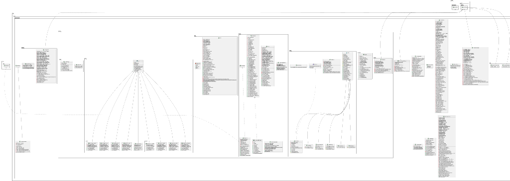
</p>

*Sơ đồ chi tiết thể hiện mối quan hệ giữa các gói `entities.ball`, `entities.paddle`, `entities.brick`, `entities.item`, `entities.data`, `entities.map`, `Setting`, `ui` và controller chính `GamePanel`.*

---

## 🏗️ Kiến trúc & Design Patterns

Dự án áp dụng chặt chẽ các nguyên lý thiết kế Hướng đối tượng (**OOP**) và các mẫu thiết kế kinh điển:

```
src/main/java/uet/ltnc/arkanoidgame/
├── ArkanoidGame.java            # Entry point JavaFX Application
├── GamePanel.java               # Controller chính, điều phối Game Loop & Renderer
├── GameStatusPanel.java         # HUD hiển thị Mạng, Điểm, Cấp độ, Buff hoạt động
├── GameConstants.java           # Định nghĩa hằng số kích thước, tốc độ, giới hạn
├── SoundManager.java            # Quản lý phát âm thanh SFX và BGM (MediaPlayer/AudioClip)
├── ThemeManager.java            # Quản trị đường dẫn tài nguyên hình ảnh theo Theme
├── HighScoreScreen.java         # Màn hình Bảng xếp hạng kỷ lục
├── Setting/                     # Quản trị cấu hình và màn hình Cài đặt
├── entities/
│   ├── ball/Ball.java           # Thực thể quả bóng, vật lý chuyển động, sub-stepping
│   ├── paddle/Paddle.java       # Thanh hứng, xử lý phím bấm & chuột, hiệu ứng kích thước
│   ├── brick/                   # Hệ thống gạch (Factory, Grid, Weak, Medium, Strong, Move, Unbreakable)
│   ├── item/                    # Hệ thống Vật phẩm (Item, BuffManager, Buffs & Debuffs)
│   ├── map/                     # Trình nạp màn chơi từ CSV (MapLoader, MapManager)
│   ├── menu/MainMenu.java       # Giao diện Menu chính
│   └── data/                    # Lưu trữ GameState, HighScore, Score logic
└── ui/
    └── HighScoreNameDialog.java # Hộp thoại nhập tên người chơi khi đạt High Score
```

### Các Mẫu Thiết kế (Design Patterns) áp dụng:
1. **Factory Method Pattern (`BrickFactory`)**: Khởi tạo linh hoạt các loại gạch (`BrickWeak`, `BrickMedium`, `BrickStrong`, `BrickUnbreakable`, `BrickPowerup`, `BrickMove`) dựa trên ký tự định nghĩa từ file CSV map.
2. **Manager / Façade Pattern**: Đóng gói các hệ thống phức tạp thông qua các lớp quản lý chuyên biệt: `SoundManager`, `ThemeManager`, `SettingManager`, `BuffManager`, `MapManager`, `HighScoreManager`, `GameSaveManager`.
3. **Strategy / Polymorphism (`Item` & `Brick`)**: Lớp trừu tượng `Item` định nghĩa `apply(Paddle, Ball)` để từng lớp Buff/Debuff tự áp dụng hiệu ứng mà không làm thay đổi logic gọi ở `BuffManager`.
4. **State Persistence Pattern**: Đóng gói trạng thái trò chơi trong `GameState` cho phép tuần tự hóa/giải tuần tự hóa sang file dữ liệu `gamesave.txt`.

---

## 💻 Hướng dẫn Cài đặt & Chạy Game

### Yêu cầu Hệ thống (Prerequisites)
- **Hệ điều hành**: Windows / macOS / Linux
- **Java Development Kit (JDK)**: Phiên bản **17 trở lên**
- **Apache Maven**: Phiên bản **3.8 trở lên**

### Các bước cài đặt & khởi chạy:

1. **Clone repository về máy**:
   ```bash
   git clone https://github.com/tungcder/ARKANOID_LTNC.git
   cd ARKANOID_LTNC
   ```

2. **Biên dịch dự án với Maven**:
   ```bash
   mvn clean compile
   ```

3. **Khởi chạy trò chơi**:
   ```bash
   mvn javafx:run
   ```
   *Hoặc chạy trực tiếp class chính `uet.ltnc.arkanoidgame.ArkanoidGame` trong các IDE (IntelliJ IDEA, Eclipse, VS Code).*

---

## 🕹️ Hướng dẫn Chơi & Điều khiển

<p align="center">
  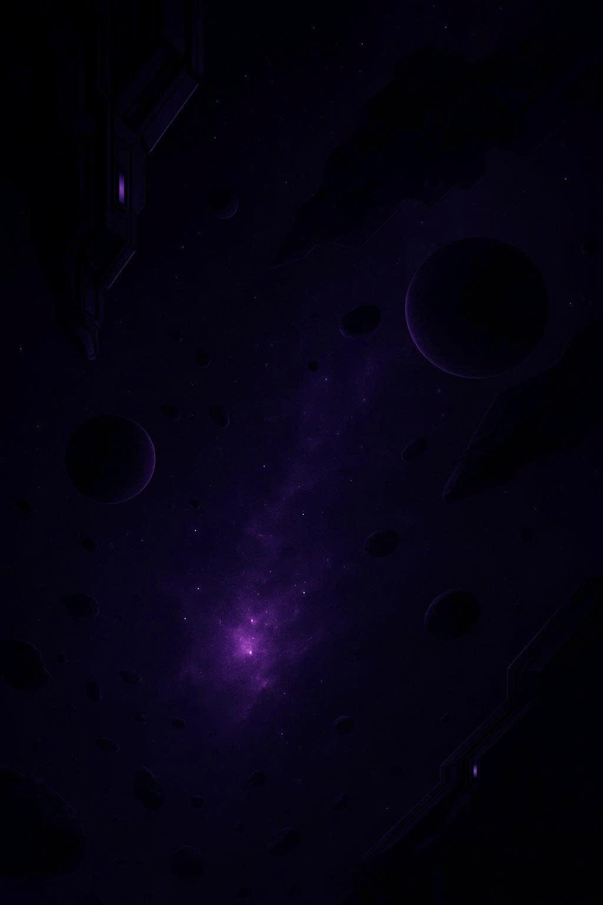
</p>

### Bảng Điều khiển:
| Phím / Thao tác | Chức năng |
| :--- | :--- |
| `⬅` / `Phím A` | Di chuyển thanh hứng sang **Trái** |
| `➡` / `Phím D` | Di chuyển thanh hứng sang **Phải** |
| `Di chuyển Chuột` | Điều khiển thanh hứng theo con trỏ chuột |
| `Phím Space` (Cách) | **Phát bóng** khi bóng đang dính trên thanh hứng |
| `Phím P` / `ESC` | **Tạm dừng** / Tiếp tục ván chơi |
| `Nút Pause trên HUD` | Tạm dừng game và hiện menu Pause |

### Quy tắc trò chơi:
1. **Mục tiêu**: Điều khiển thanh hứng đỡ bóng để phá vỡ toàn bộ các viên gạch có thể phá trên màn hình mà không làm rơi bóng xuống đáy.
2. **Số mạng**: Người chơi khởi đầu với **3 mạng**. Mỗi lần bóng rơi qua thanh hứng sẽ mất 1 mạng. Hết mạng $\rightarrow$ Game Over.
3. **Tính điểm**: Phá vỡ gạch liên tiếp sẽ kích hoạt hệ thống **Combo Multiplier** giúp tăng điểm số vượt bậc.
4. **Hoàn thành màn**: Phá hết gạch sẽ tự động chuyển sang Level tiếp theo. Vượt qua 4 Level để giành chiến thắng chung cuộc (**Victory**).

---

## 💊 Hệ thống Vật phẩm (Buff & Debuff)

Khi phá vỡ các viên gạch đặc biệt (`BrickPowerup`), vật phẩm sẽ rơi xuống:

### 🟢 Hiệu ứng Có lợi (Buffs):
| Biểu tượng | Tên Buff | Tác dụng | Thời gian |
| :---: | :--- | :--- | :---: |
| 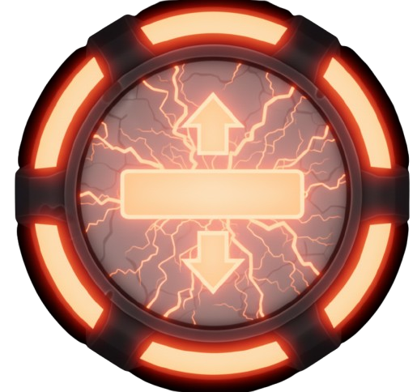 | **Bigger Paddle** | Tăng chiều dài thanh hứng thêm **40%**, giúp đỡ bóng dễ dàng hơn. | 7 giây |
| 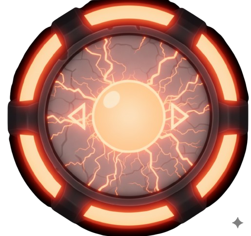 | **Bigger Ball** | Tăng kích thước quả bóng thêm **50%**, mở rộng diện tích va chạm gạch. | 7 giây |
| 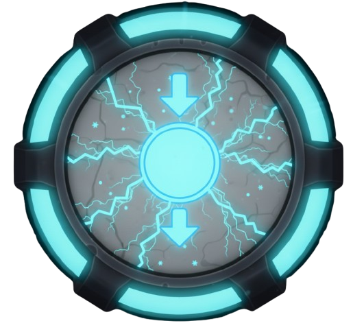 | **Slower Ball** | Giảm tốc độ bóng, giúp người chơi dễ kiểm soát tình huống. | 7 giây |
| 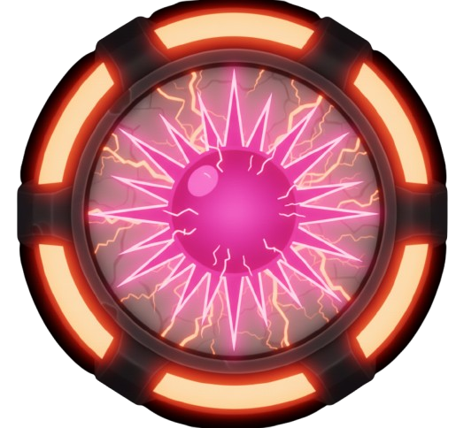 | **Explosive Ball** | Biến quả bóng thành cầu lửa, phát nổ phá hủy gạch xung quanh điểm chạm. | 7 giây |
|  | **Extra Lives** | Cộng ngay **+1 Mạng** cho người chơi (Tối đa 5 mạng). | Vĩnh viễn |

### 🔴 Hiệu ứng Bất lợi (Debuffs):
| Biểu tượng | Tên Debuff | Tác dụng | Thời gian |
| :---: | :--- | :--- | :---: |
| 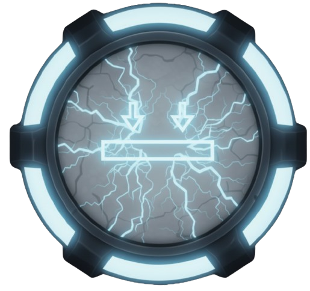 | **Smaller Paddle** | Thu nhỏ thanh hứng còn **70%**, tăng độ khó khi đỡ bóng. | 7 giây |
| 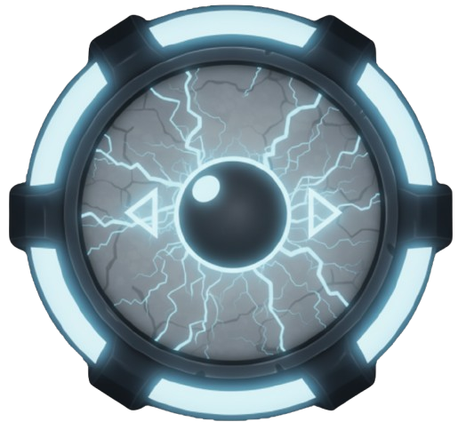 | **Smaller Ball** | Thu nhỏ bóng còn **80%**, khó quan sát và khó phá nhiều gạch. | 7 giây |
| 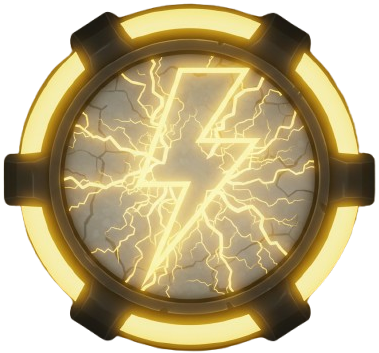 | **Fast Ball** | Tăng tốc độ bóng gấp **1.5 lần**, đòi hỏi phản xạ cực nhanh. | 7 giây |
| 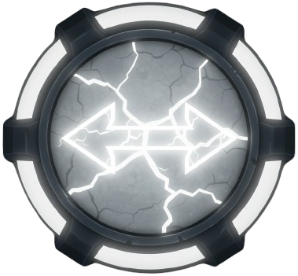 | **Reverse Controls**| **Đảo ngược phím bấm** (Ấn Trái chạy Phải, ấn Phải chạy Trái). | 5 giây |

---

## 🧱 Hệ thống Gạch & Màn chơi

- **Weak Brick (Gạch yếu)**: Vỡ sau **1 lần** va chạm.
- **Medium Brick (Gạch vừa)**: Cần **2 lần** va chạm; hiển thị vết nứt sau phát đánh đầu tiên.
- **Strong Brick (Gạch cứng)**: Cần **3 lần** va chạm; thể hiện 3 cấp độ vỡ nứt.
- **Unbreakable Brick (Gạch kim loại)**: Không thể phá hủy, đóng vai trò chướng ngại vật định hướng góc bóng.
- **Moving Brick (Gạch di chuyển)**: Tự động di chuyển qua lại liên tục, tạo thử thách ngẫu nhiên khi căn góc.
- **Powerup Brick**: Chứa các phần quà Buff hoặc cạm bẫy Debuff ngẫu nhiên.

---

## 👥 Phân công Công việc & Đóng góp

Dự án được thực hiện bởi nhóm sinh viên **Trường Đại học Công nghệ - ĐHQGHN (UET)**:

| STT | Họ và Tên | Mã Sinh Viên | Vai trò & Trách nhiệm chính                                                                                                                                                                                                      | Tỉ lệ đóng góp |
| :---: | :--- | :---: |:---------------------------------------------------------------------------------------------------------------------------------------------------------------------------------------------------------------------------------| :---: |
| 1 | **Đào Ngọc Duy** | **24022637** | **Thành viên**: Kiến trúc Core Engine, Vật lý chuyển động & va chạm (Sub-stepping, Paddle physics), Hệ thống High Score (nhập tên & lưu trữ), Lưu/Tải trạng thái Game (Save/Load), Tích hợp âm thanh.                            | **33.3%** |
| 2 | **Triệu Tuấn Thành** | **24020310** | **Nhóm trưởng**: Thiết kế Hệ thống Gạch & Factory Pattern (`BrickFactory`, `BrickGrid`, `BrickMove`), Xây dựng Hệ thống Vật phẩm Buff & Debuff (`BuffManager`, 9 Items), Module nạp màn chơi từ CSV (`MapLoader`, `MapManager`). | **33.3%** |
| 3 | **Hoàng Thanh Tùng** | **24020351** | **Thành viên**: Thiết kế Giao diện người dùng & Điều hướng màn hình (`MainMenu`, `GameOverScreen`, `GameCompleteScreen`, `SettingScreen`), Hệ thống Chủ đề (3 Themes), Quản lý Âm thanh/Cài đặt, Demo & Tài liệu hóa.            | **33.4%** |

> 📄 *Xem báo cáo chi tiết nhiệm vụ và lịch sử đóng góp tại: [**BAO_CAO_PHAN_CONG.md**](BAO_CAO_PHAN_CONG.md)*.

---

<p align="center">
  <i>Đồ án môn học Lập trình Nâng cao / Lập trình Hướng đối tượng (OOP) - UET VNU 2026</i>
</p>
